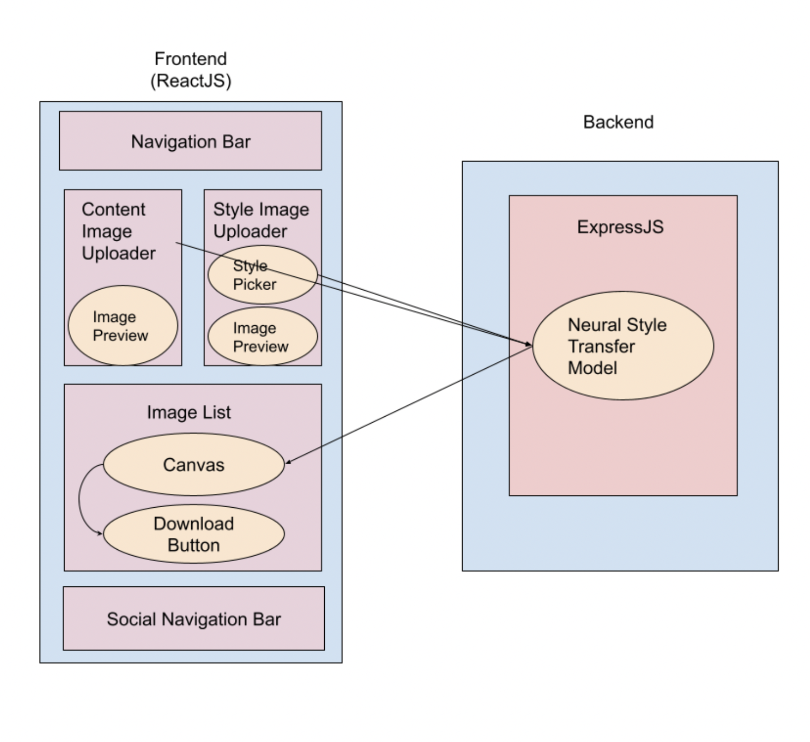

# Neural Style Transfer Website

Users are able to upload a picture to our web app which is processed and an output image is provided of the given picture that is rendered in the painting styles that are chosen. These styles will be chosen by the user, either by selecting from a bank of different artistic renditions or potentially by listing mood keywords that match the desired outcome. The users will then be able to save the picture or have the option to share it on social media. 

<a name="readme-top"></a>


<details>
  <summary>Table of Contents</summary>
  <ol>
    <li>
      <a href="#about-the-project">About The Project</a>
      <ul>
        <li><a href="#introduction">Introduction</a></li>
      </ul>
    </li>
    <li>
      <a href="#technical-architecture">Technical Architecture</a>
      <ul>
        <li><a href="#components">Components</a></li>
        <li><a href="#diagram">Diagram</a></li>
      </ul>
    </li>
    <li><a href="#installation-and-usage">Installation and Usage</a></li>
    <li><a href="#group-members-and-their-roles">Group members and their roles</a></li>
    <li><a href="#license">License</a></li>
    <li><a href="#acknowledgements">Acknowledgements</a></li>
  </ol>
</details>

## About the Project


Users are able to upload a picture to our web app which is processed and an output image is provided of the given picture that is rendered in the painting styles that are chosen. These styles will be chosen by the user, either by selecting from a bank of different artistic renditions or potentially by listing mood keywords that match the desired outcome. The users will then be able to save the picture or have the option to share it on social media. 

### Introduction

Our project is a website allows you to apply a certain syle from an artist or image and "paint" it onto a base image that you can also choose. This process is called Neural Style Transfer and works by using a Deep Neural Network Model that is sources from TensorFlow

Users of the website can scroll through some brief information on Neural Networks and Deep Learning until they scroll to the Style Transfer part of the app.


## Technical Architecture

[![React][React.js]][React-url] [![JavaScript][JavaScript]][JavaScript-url] [![TensorFlowJs][TensorFlowJS]][TensorFlowJS-url]

Our project utilizes React with JavaScript frontend, Express as a backend, and TensorFlowJS for the model.


## Components

### Diagram




### Express Server

We utilize an Express.js backend to run our server-side functionality which statically serves the model from our local machines to the backend API, which is to be fetched later from our frontend application. Having this backend is necessary for our application because unfortunately React does not support the traditional inclusion of tensorflow js via vanilla JS script tags, so our workaround is to deploy the model JSON onto a server and access it from there.

### Style Transfer Model

Used tensorflowjs_converter to convert Google’s arbitrary image stylization model from a Keras model to tensorflow.js. After model is successfully loaded, it can be called by the user by selecting images to actually perform a stylization. Once it is called, the content and style images are passed into the model as tensors, and after the process is executed, the output image is drawn onto a canvas to be displayed in our ImageList component.

### Social Navigation Bar

Uses the React-Share Library. Role of the navigation bar is to allow users to easily share the website with other people via social media (Twitter, Facebook, Email). Does not directly interact with other components of the application, but it does keep track of the website url which it incorporates into a default message.

### Download Button

Uses the standard ReactJS library. The role of the button is to allow the user to easily download the stylized image. The download button interacts with canvas element containing the stylized image to convert it to a downloadable png image.

###

## Installation and Usage

1. Clone the repo:
   ```sh
   git clone https://github.com/CS222-UIUC/course-project-group-97.git
   ```
2. Change directory into the `web-app` folder:
    ```sh
    cd web-app
    ```
3. In the `web-app` directory, install npm dependencies:
   ```sh
   npm install
   ```
4. Open another terminal and move to the `server` directory. 
    ```sh
    cd server
    ```
5. In the `server` directory, install the server npm dependencies:
   ```sh
   npm install
   ```
6. Start the express server once in the `server` folder. 
    ```sh
    node .
    ```    
7. Switch back to the terminal window In the `web-app` directory and start the React app:
    ```sh
    npm start
    ```

8. In your browser, go to [http://localhost:3000](http://localhost:3000) to see the website locally.

## Group Members and Their Roles

[Jacob Shalabi](https://github.com/jshalabi03) worked with creating a backend server to host our tensorflow model that applies the styles onto the image. He created the model from that was in JavaScript to be compatible with react. Jacob also worked on many crucial functions such as

[Ritul K. Soni](https://github.com/RitulSoni) created the Nav Bar that redirects users to portions of the single page website. He also worked with Parallax implementing aesthetic features for the website. He worked primarily on the frontend creating the style of the website.

[Jacob Ko](https://github.com/jacobko57) created the react share button where users can share the images they created with the style transfer to social media sites such as Twitter, Facebook, and also Email. Also helped to implement the button used to download the stylized image. 

[Daniel Ku](https://github.com/dk9966) created the look of the Neural Style Transfer app the file upload buttons needed for users to upload their own images. He also created the barebones website where we expanded upon. 


## License
Distributed under the MIT License. See `LICENSE.txt` for more information.

## Acknowledgements
Thank you to TensorFlow for the model we used for our app to work. 

<p align="right">(<a href="#readme-top">back to top</a>)</p>

<!-- Links & Images -->
[contributors-shield]: https://img.shields.io/github/contributors/CS222-UIUC/course-project-group-97.svg?style=for-the-badge
[contributors-url]: https://github.com/CS222-UIUC/course-project-group-97/graphs/contributors
[stars-shield]: https://img.shields.io/github/stars/CS222-UIUC/course-project-group-97.svg?style=for-the-badge
[stars-url]: https://github.com/CS222-UIUC/course-project-group-97/stargazers
[React.js]: https://img.shields.io/badge/React-20232A?style=for-the-badge&logo=react&logoColor=61DAFB
[React-url]: https://reactjs.org/
[JavaScript]:https://img.shields.io/badge/JavaScript-JS-yellowgreen
[JavaScript-url]: https://www.javascript.com
[TensorFlowJs]: https://img.shields.io/badge/TensorFlow-TensorFlow.js-blue
[TensorFlowJs-url]: https://www.tensorflow.org

